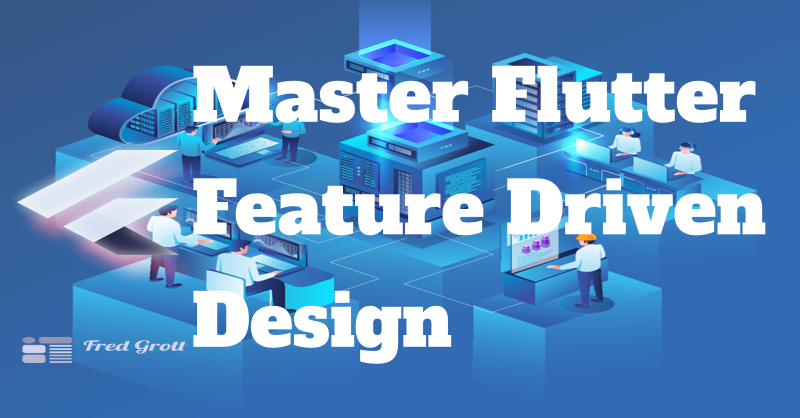

# Master Flutter Feature Driven Design

It's simple, with Stateless and Stateful widgets we have in fact a Flutter framework that is view-model MVVM oriented as opposed to React.js framework which is MVC oriented. We can cheat and modify the Domain Driven Design application architecture to be aligned with our own storyboarding design workflow.

The other factor is that due to the framework working with 
the build function means that the build function in widgets is the state reducer similar to what the React.js framework does with its virtual liteDOM. This simply means that we can use any DI and state management combination.

So this repo will show the lowly ToDo App grouped by DI+StateManagementSolution by step. This way it also doubles as how to master state management as well.

## Articles

Articles can be found at my substack:

[My Flutter Substack](https://fedgrott.substack.com)

## Implementation Notes

About the only thing that needed modification was the CQRS part.
The rest of the modifications is to fit into both DevicePreview and storyboard (Widgetbook) workflows. 

And that generally requireed layers to be packages including localization. The DevicePreview and Widgetbook are made their own specialized apps and app wrappers.

### CQRS

Even though we do not use CRUD-SQL anymore we can still use the segregation of command and query to decouple both non-presentation and presentation layers and their elements.

I specifically use the streamline package to implement CQRS.

## Background

[Wikipedia DDD](https://en.wikipedia.org/wiki/Domain-driven_design(

[Martin Fowler Biki](https://martinfowler.com/bliki/DomainDrivenDesign.html)